# Lecturn

**Your work, illuminated.**


Lecturn brings coding agents into one workspace on desktop, web, and mobile. Keep your projects and conversations close, explore another direction with a fork, and return to your work from another device. Its midnight blue, parchment, and brass palette shares a world with [Stave](https://github.com/Nurozen/stave/tree/weirwood), with a library of its own.

Use the coding-agent subscriptions and credentials you already have: Claude Code, Codex, Cursor, Grok Build, OpenCode, or Google Antigravity. Install and authenticate at least one provider on the computer that hosts your work. For Antigravity, enable it in Settings, then use **Install Antigravity** and **Sign in with Google**.

[Download desktop](https://github.com/Nurozen/lecturn/releases) · [Open Lecturn](https://lecturn.cloudgatherer.net) · [Installation guide](./docs/user/lecturn-installation.md)

## A place for the work

Organize conversations by project, choose a provider and permission mode, and keep the working context in view. Project icons and golden hierarchy lines make related work easy to find, whether it lives in a local folder, a Stave space, or a saga.


_Product images use synthetic demonstration content, without real account emails or private conversations. Native layout previews are labeled separately._

## Give related work a home

A [Stave space](./docs/user/stave.md) brings several editable repositories and reference checkouts into one project. A saga groups related spaces and their conversations in the same tree. Git and PR views follow that hierarchy: inspect a thread's repositories, a whole space, or the spaces within a saga.

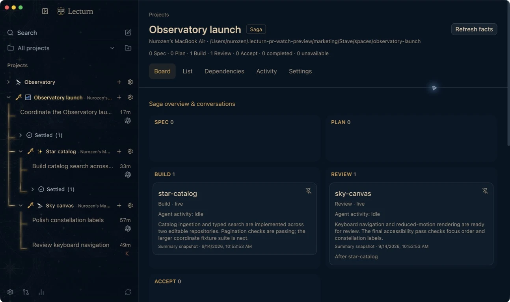

On desktop and web, saga boards follow **Spec → Plan → Build → Review → Accept**. Summaries and inferred phases update together from recent conversations. Pin a phase to keep it in place, or switch to manual movement and drag cards between columns. Mobile shares the project hierarchy; the custom saga board is available on desktop and web.

## Follow the work through review

Keep a PR beside the conversation that created it. Watch its CI jobs, see what the managing agent is doing, and send a quick steer when it needs direction. Linked PRs are discovered automatically, including work across editable repositories in Stave spaces; each thread can show more than one PR.

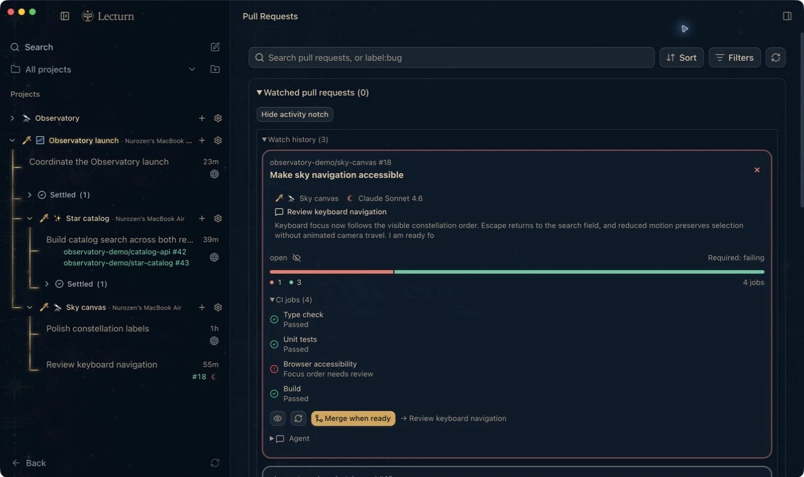

_Synthetic PR snapshots, paused for the demonstration._

**Merge when ready** asks the managing agent to watch CI and reviews, address failures, report blockers, and merge when required checks and repository rules pass. The instruction goes into its conversation and uses the agent's normal tools and permissions. [Read about PR tracking and agent handoff](./docs/user/notifications-and-live-activities.md#pull-request-activity).

## A glance at the notch

The Mac activity panel keeps your three recent unsettled conversations and watched PRs close. Hover for a compact peek, expand a card for its current task and CI jobs, or steer the agent without returning to the main window. Gold marks work in progress, amber asks for attention, and completed work turns green.

<p align="center">
  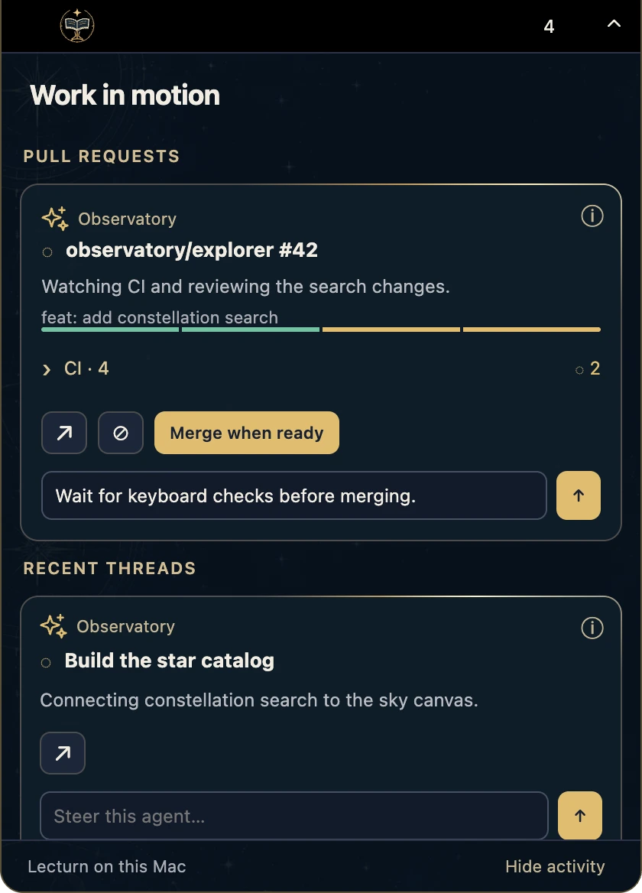
  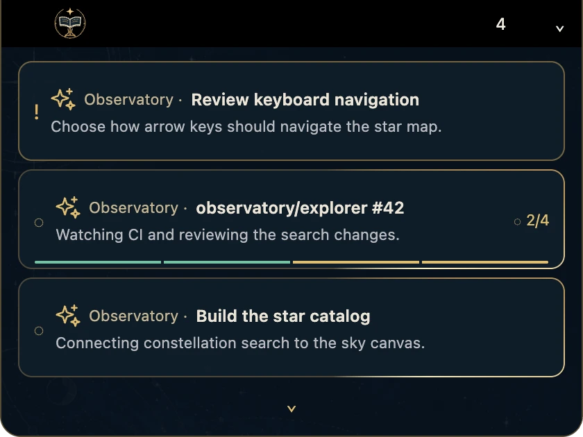
</p>

<details>
<summary>See individual CI jobs and a state-change preview</summary>

<p align="center">
  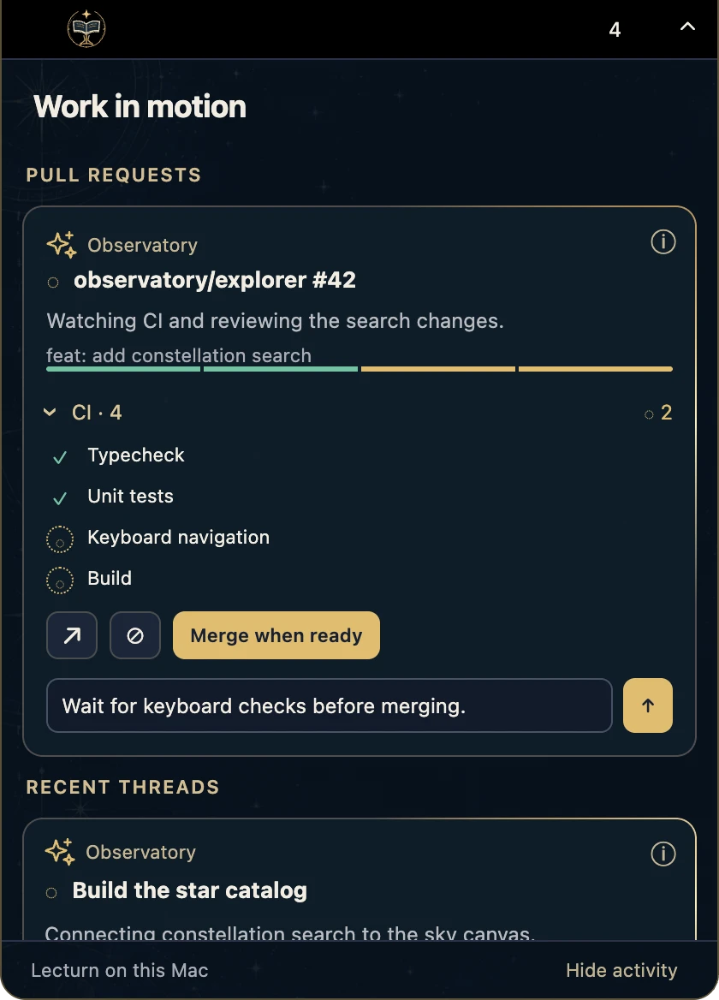
  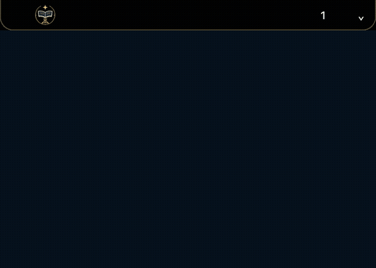
</p>

</details>

_Mac activity layout preview with synthetic tasks and checks; hardware notch placement varies by display._

Meaningful changes briefly surface a preview; streaming text and your own actions stay quiet. Manual expansion stays open until you dismiss it. The panel joins the camera notch on supported displays and is also available from the menu bar. This local Mac feature does not require a Connect subscription. [Explore the activity panel](./docs/user/notifications-and-live-activities.md#mac-activity-panel).

## Put finished conversations away

Settle a thread to tuck it into an expandable **Settled** shelf beneath its project. Its conversation, linked PRs, and model settings remain available. A red-gold **Unsettle** action replaces the composer until you are ready to continue.

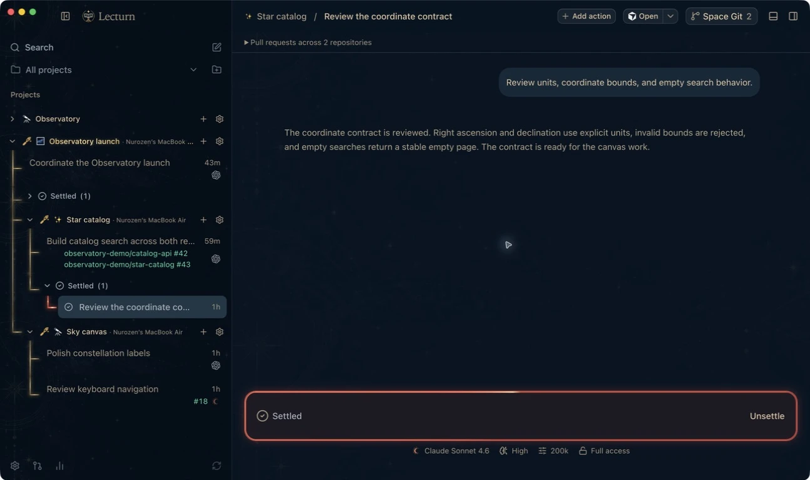

Snooze work that should return later, or reopen a settled conversation when its next chapter begins. [Organize your threads](./docs/user/thread-sidebar.md).

## Follow another thread

Fork a completed reply to explore another approach without replacing the original conversation. On desktop and web, hover over a reply for **Fork from here**, or use the bottom-left fork shortcut on a conversation card to continue from its latest completed reply.


_Forking is available for Codex, Claude, and OpenCode. Cursor, Grok, and Antigravity do not yet expose fork actions in Lecturn. Forks share the original working folder; they do not automatically isolate file edits. [Read the forking guide](./docs/user/forking-threads.md)._

## Take your place with you


Lecturn Connect links your hosting computers to your account for remote access, managed notifications, and Live Activities. The hosting app must remain running. Local connections, direct pairing, SSH, and Tailscale remain free; managed Connect requires an active subscription, trial, or explicit complimentary access. Connect costs $10/month or $100/year for three managed environments, with a 14-day card-required trial.

Your workspace, in glass. Rounded conversations, floating controls, and translucent project cards keep the celestial backgrounds in view. Choose pearl and copper in light mode or midnight and gold in dark mode. Model and access settings stay within reach, alongside files, terminal, Git, review, and approvals. Accessibility settings can replace transparent materials with solid surfaces. [Explore mobile appearance](./docs/user/mobile-appearance.md).

<p align="center">
  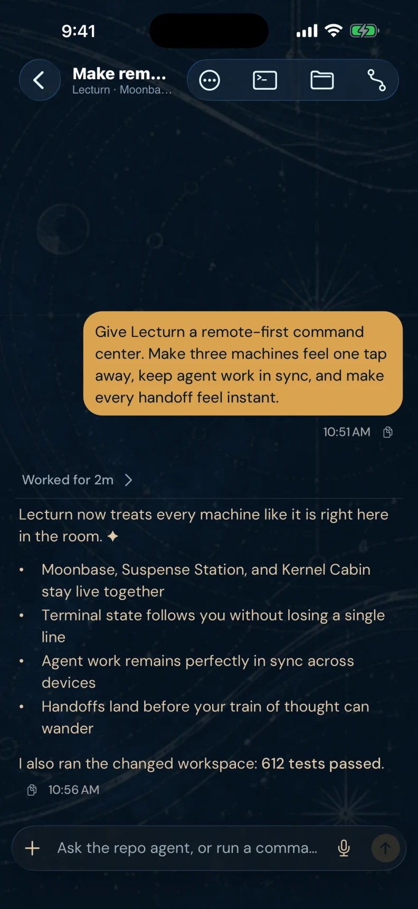
  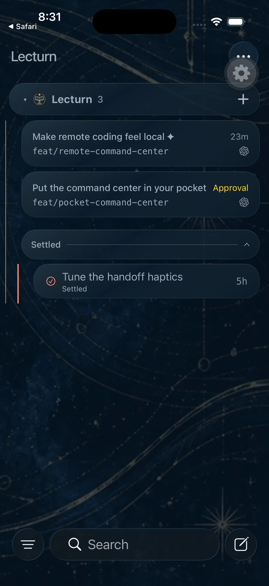
  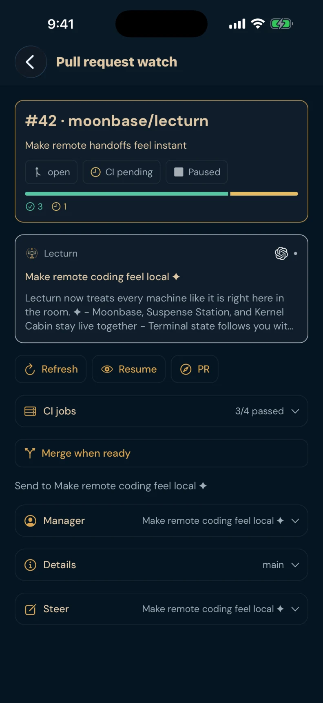
</p>

Follow a pull request from your phone: inspect CI jobs, steer its managing agent, or send **Merge when ready** to that conversation. The agent receives instructions to wait for required checks and repository merge rules before merging.

_Current iPhone app, captured in the iOS simulator with synthetic projects and conversations. The floating gear is a development-build control. Sample PR snapshots are paused; steering and merge handoff were verified with a recording test provider, without performing GitHub actions._

<details>
<summary>Pearl glass and copper accents in light mode</summary>

<p align="center">
  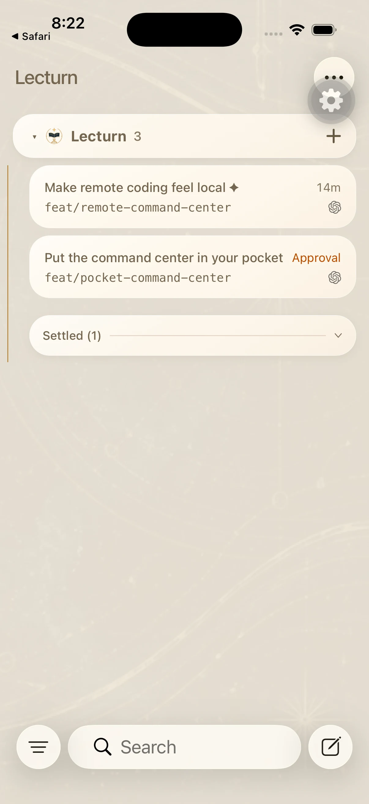
</p>

</details>

The iOS app is a companion to your existing account access. Notification delivery also needs device permission and the corresponding settings enabled. See [Connect access](./docs/user/connect-subscription.md) and [remote access](./docs/user/remote-access.md) for details.

## Stay connected to your agents

Step away without losing track. Live Activities show agent progress and watched PR activity on your iPhone Lock Screen and, on supported devices, Dynamic Island. Open an activity to inspect CI, reach the managing conversation, and send a steer or merge instruction through Lecturn's authenticated controls. The phone app uses the same status colors and project identities as desktop and web.

<p align="center">
  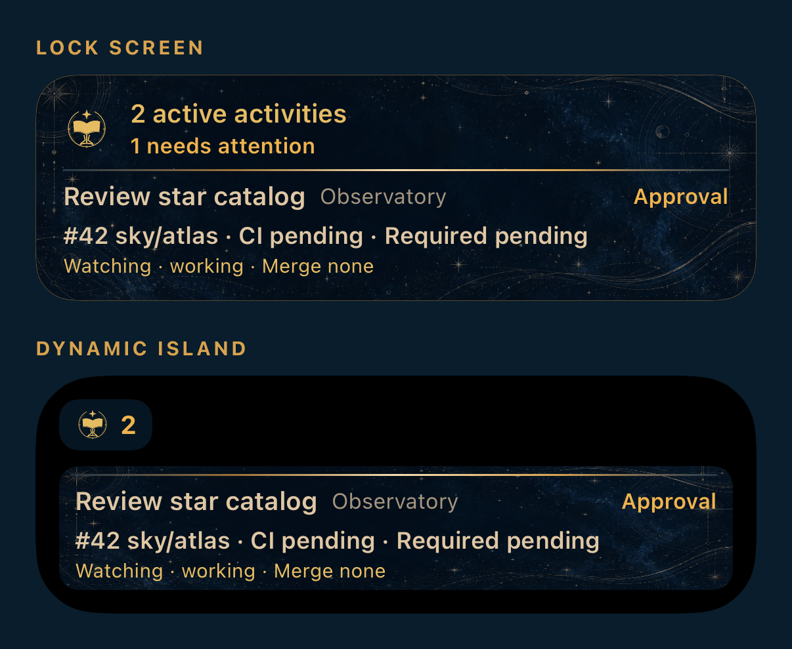
</p>

_Native layout preview with synthetic activity data. This shows the widget content, not a delivered notification; presentation varies by device._

Managed notifications and Live Activities are included in the paid **Lecturn Connect** plan described above, including its trial and complimentary access. They require an online hosting computer, device setup, and enabled activity publishing. Standard notification banners retain the system appearance. [Set up notifications and Live Activities](./docs/user/notifications-and-live-activities.md).

## Installation and access

- **Desktop:** use a Lecturn installer from [Lecturn releases](https://github.com/Nurozen/lecturn/releases). Follow [Install Lecturn](./docs/user/lecturn-installation.md) for application identity, data isolation, and first connection instructions.
- **Web:** [lecturn.cloudgatherer.net](https://lecturn.cloudgatherer.net). Sign in and connect to a computer hosting Lecturn.
- **iPhone and iPad:** TestFlight access is invitation-only. There is no public Lecturn App Store release yet.
- **Android:** source is included in [`apps/mobile`](./apps/mobile); distribution is currently source-only.

Lecturn stores its runtime data in `~/.lecturn/userdata`. See the installation guide for application identity and data-directory configuration.

The standalone CLI command is `lecturn`. See the installation guide for runtime distribution and hosting details.

## Development

Install [Vite+](https://viteplus.dev/guide/), then install dependencies and start the local development environment:

```bash
vp i
vp run dev
```

Read [AGENTS.md](./AGENTS.md) and [CONTRIBUTING.md](./CONTRIBUTING.md) before making changes. Architecture and contributor documentation start at [docs/internals/overview.md](./docs/internals/overview.md).

## Documentation

- [Lecturn installation and data isolation](./docs/user/lecturn-installation.md)
- [Stave spaces and saga boards](./docs/user/stave.md)
- [Project hierarchy and thread organization](./docs/user/thread-sidebar.md)
- [PR tracking and agent handoff](./docs/user/notifications-and-live-activities.md#pull-request-activity)
- [Mac activity panel](./docs/user/notifications-and-live-activities.md#mac-activity-panel)
- [Forking conversations](./docs/user/forking-threads.md)
- [Importing Claude Code and Codex sessions](./docs/user/importing-sessions.md)
- [Connect access](./docs/user/connect-subscription.md)
- [Notifications and Live Activities](./docs/user/notifications-and-live-activities.md)
- [Permission modes](./docs/user/permission-modes.md)
- [Keyboard shortcuts](./docs/user/keybindings.md)
- [Project settings](./docs/user/project-settings.md)
- [Remote access](./docs/user/remote-access.md)
- [Source control integrations](./docs/user/source-control.md)
- Multiple provider accounts: [Codex](./docs/user/providers-codex.md) · [Claude](./docs/user/providers-claude.md)

Report Lecturn issues in [this repository](https://github.com/Nurozen/lecturn/issues).

## License

Lecturn is independently maintained and operated by Cloud Gatherer Labs LLC. The project is available under the [MIT license](./LICENSE), which preserves the original copyright and permission notices. See [NOTICE.md](./NOTICE.md) for bundled third-party notices.
