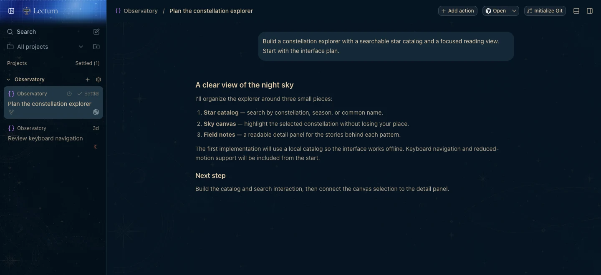
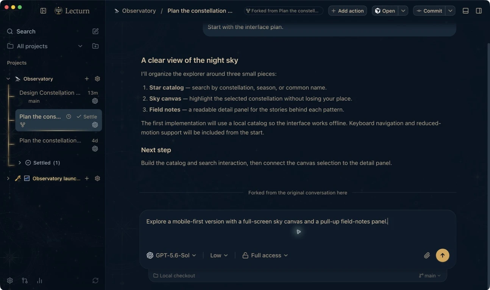

# Lecturn

**Your work, illuminated.**


Lecturn brings coding agents into one workspace on desktop, web, and mobile. Keep your projects and conversations close, explore another direction with a fork, and return to your work from another device. Its midnight blue, parchment, and brass palette shares a world with [Stave](https://github.com/Nurozen/stave/tree/weirwood), with a library of its own.

Use the coding-agent subscriptions and credentials you already have: Claude Code, Codex, Cursor, Grok Build, or OpenCode. Install and authenticate at least one provider on the computer that hosts your work.

[Download desktop](https://github.com/Nurozen/lecturn/releases) · [Open Lecturn](https://lecturn.cloudgatherer.net) · [Installation guide](./docs/user/lecturn-installation.md)

## A place for the work

Organize conversations by project, choose a provider and permission mode, and keep the working context in view. Snooze a thread for later or settle it when the work is done.



_The running Lecturn interface with synthetic demonstration content. Usage images contain no real account emails or private conversations._

## Follow another thread

Fork a completed reply to explore another approach without replacing the original conversation. On desktop and web, hover over a reply for **Fork from here**, or use the bottom-left fork shortcut on a conversation card to continue from its latest completed reply.



_Forking is available for Codex, Claude, and OpenCode. Cursor and Grok do not yet expose fork actions in Lecturn. Forks share the original working folder; they do not automatically isolate file edits. [Read the forking guide](./docs/user/forking-threads.md)._

## Take your place with you


Lecturn Connect links your hosting computers to your account for remote access, managed notifications, and Live Activities. The hosting app must remain running. Local connections, direct pairing, SSH, and Tailscale remain free; managed Connect requires an active subscription, trial, or explicit complimentary access. Connect costs $10/month or $100/year for three managed environments, with a 14-day card-required trial.

The iOS app is a companion to your existing account access. Notification delivery also needs device permission and the corresponding settings enabled. See [Connect access](./docs/user/connect-subscription.md) and [remote access](./docs/user/remote-access.md) for details.

## Installation and access

- **Desktop:** use a Lecturn installer from [this fork's releases](https://github.com/Nurozen/lecturn/releases). Follow [Install Lecturn alongside T3 Code](./docs/user/lecturn-installation.md) for application identity, data isolation, and first connection instructions.
- **Web:** [lecturn.cloudgatherer.net](https://lecturn.cloudgatherer.net). Sign in and connect to a computer hosting Lecturn.
- **iPhone and iPad:** TestFlight access is invitation-only. There is no public Lecturn App Store release yet.
- **Android:** source is included in [`apps/mobile`](./apps/mobile); distribution is currently source-only.

Lecturn uses its own app identity and `~/.lecturn/userdata`, so it can coexist with T3 Code. It does not automatically migrate your existing T3 Code data.

The standalone runtime is available as `npx lecturn`. Use this fork's releases and package names for Lecturn.

## Development

Install [Vite+](https://viteplus.dev/guide/), then install dependencies and start the local development environment:

```bash
vp i
vp run dev
```

Read [AGENTS.md](./AGENTS.md) and [CONTRIBUTING.md](./CONTRIBUTING.md) before making changes. Architecture and contributor documentation start at [docs/internals/overview.md](./docs/internals/overview.md).

## Documentation

- [Lecturn installation and data isolation](./docs/user/lecturn-installation.md)
- [Forking conversations](./docs/user/forking-threads.md)
- [Connect access](./docs/user/connect-subscription.md)
- [Permission modes](./docs/user/permission-modes.md)
- [Keyboard shortcuts](./docs/user/keybindings.md)
- [Project settings](./docs/user/project-settings.md)
- [Remote access](./docs/user/remote-access.md)
- [Source control integrations](./docs/user/source-control.md)
- Multiple provider accounts: [Codex](./docs/user/providers-codex.md) · [Claude](./docs/user/providers-claude.md)

Some inherited documentation describes upstream T3 Code distribution and services. Use the Lecturn installation guide above for this fork's application and deployment details. Report Lecturn issues in [this repository](https://github.com/Nurozen/lecturn/issues).

## Attribution and license

Lecturn is based on [T3 Code](https://github.com/pingdotgg/t3code) by T3 Tools and its contributors. Their work and copyright notices are preserved. Lecturn is independently maintained and operated by Cloud Gatherer Labs LLC; it is not affiliated with, sponsored by, or endorsed by T3 Tools Inc. or the T3 Code project. The project is available under the [MIT license](./LICENSE).
